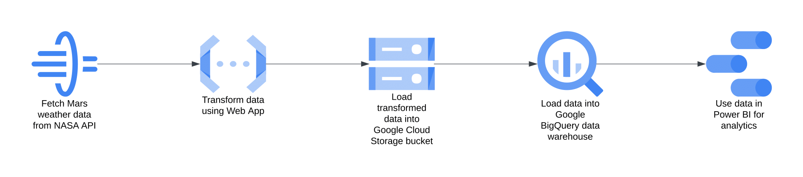

# Mars Weather Data Pipeline

## Description

A data pipeline that extracts Mars weather data from the NASA API, transforms it into an easier-to-use format, and then loads it into a Google BigQuery data warehouse, where it can be used for various purposes such as data analytics in Power BI. This data is sourced from the NASA InSight rover project, which has been gathering weather information from the Martian surface, including temperature, air pressure, and wind speed, among other parameters.

## Architecture Diagram

  
The architecture of the data pipeline is as follows:

-   **extract.go** makes the API call to NASA to retrieve the weather data.
-   **transform.go** takes the API response and reformats the data into a more accessible structure.
-   **storage.go** uploads the transformed NDJSON file to a Google Cloud Storage bucket.
-   **load.go** loads the information from the uploaded file into Google BigQuery.

These functions can be found under the `internal` folder.

The **main.go** file utilizes these internal functions to create a web application designed to be deployed on the cloud. It could be automatically triggered at regular intervals to keep the data in the data warehouse updated. However, since the NASA InSight project has ended, there is no longer a stream of new data, so this project has been run locally.

## Report and Findings

This [report](Mars_Weather_Report.pdf) contains three charts showcasing the daily averages, highs, and lows for temperatures, air pressure, and wind speeds. These visuals were created using Power BI, which loaded the data from our BigQuery data warehouse.

## Technologies Used

-   Go
-   Google Cloud Storage
-   Google BigQuery
-   Power BI

## How to Build

You will need a `.env` file with the following information (replace placeholders with actual values):

```
PORT=8080
GCS_BUCKET=YOUR_BUCKET_NAME
GCS_FILE_PATH=YOUR_FILE_PATH.json
NASA_API_KEY=YOUR_NASA_API_KEY
BQ_PROJECT_ID=YOUR_PROJECT_ID
BQ_DATASET_ID=YOUR_DATASET_ID
BQ_TABLE_ID=YOUR_TABLE_ID
```

If you are not running this code in Google Cloud, ensure you are authenticated via the Google Cloud CLI on your local machine.

Then, run the command `go run main.go` in the root project directory.
